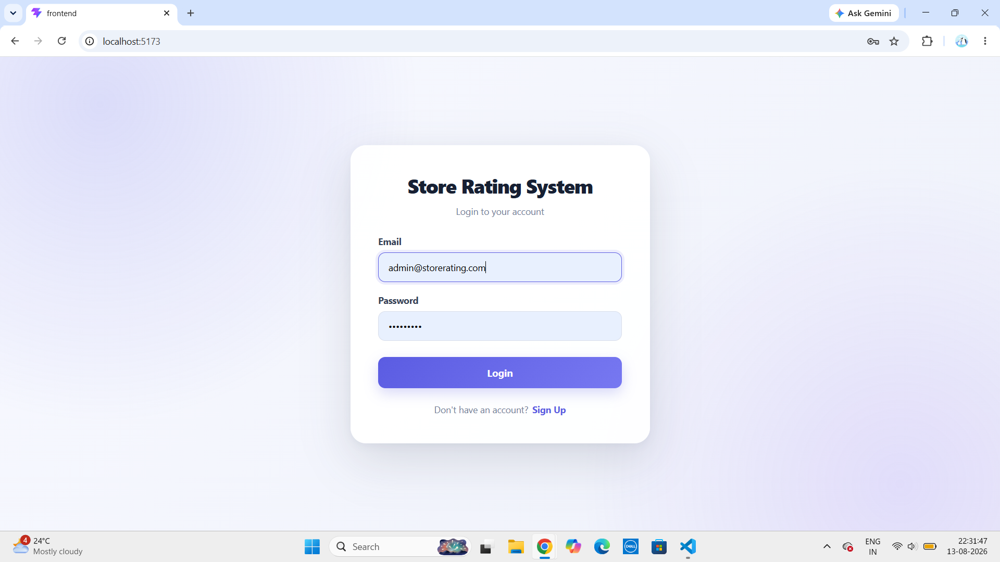
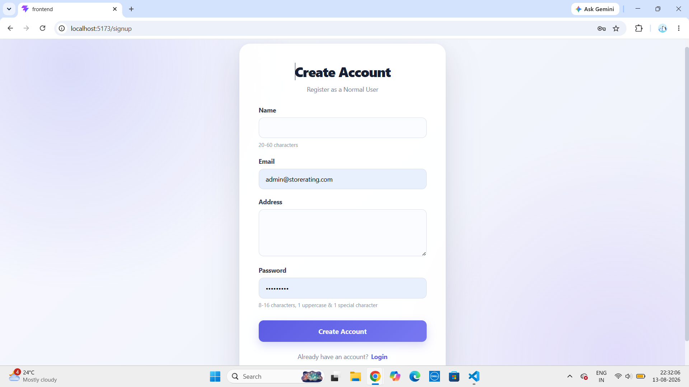
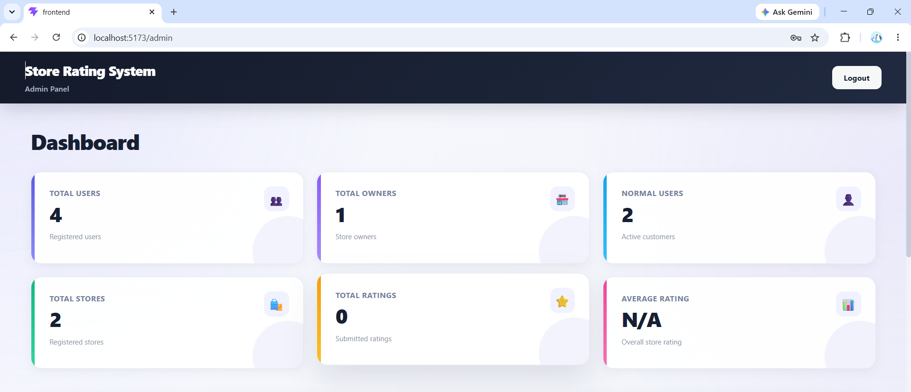
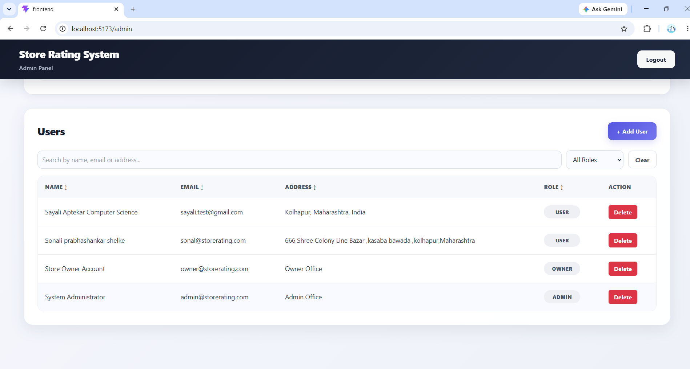
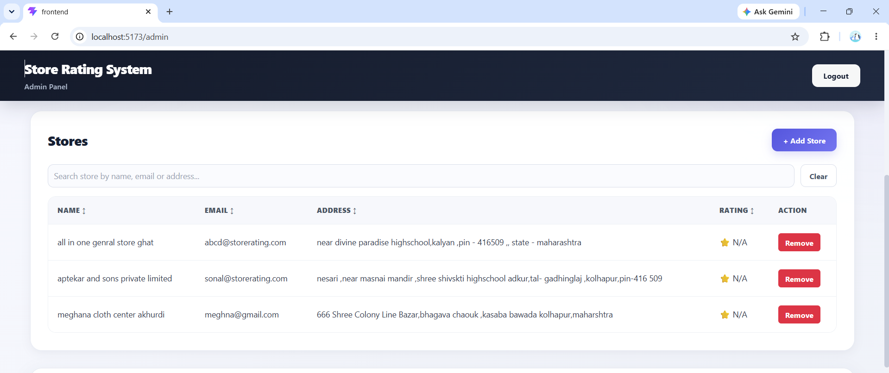
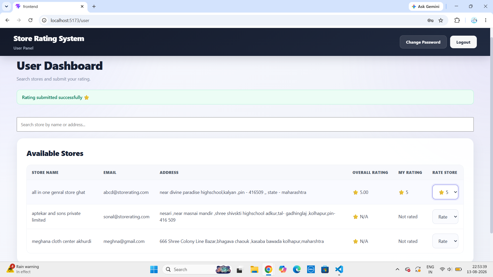
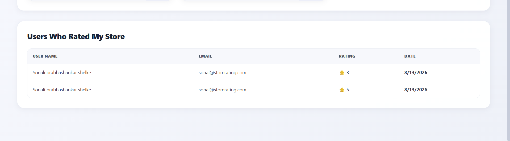
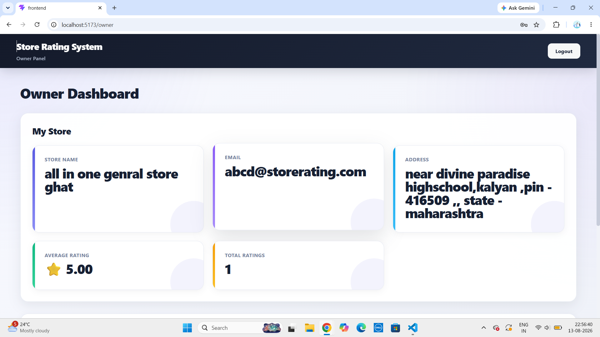
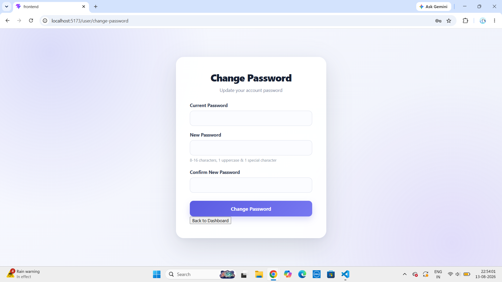

# ⭐ Store Rating System

A full-stack web application that allows users to discover stores, submit ratings, manage their accounts, and provides separate dashboards for Admins and Store Owners.

---

## 📸 Project Screenshots

> All screenshots are stored inside the `screenshots/` folder.

### 🔐 Login



### 📝 Sign Up



### 🛠️ Admin Dashboard



### 👥 Add User



### 🏪 Add Store



### 👤 User Dashboard



### ⭐ User Rating



### 👨‍💼 Owner Dashboard



### 🔑 Change Password



---

## 🚀 Technologies Used

### Frontend

* React.js
* JavaScript (ES6+)
* HTML5
* CSS3
* Vite
* Axios
* React Router DOM

### Backend

* Node.js
* Express.js
* JWT (JSON Web Token)
* bcrypt
* MySQL2
* CORS
* dotenv

### Database

* MySQL
* MySQL Workbench

### Development & Testing

* Visual Studio Code
* Git & GitHub
* Postman
* npm

---

## ✨ Key Features

### 👑 Admin

* Admin authentication
* Admin dashboard
* View total users
* View total store owners
* View normal users
* View total stores
* View total ratings
* View average rating
* Add users
* Delete users
* Add stores
* Remove stores
* Search and filter users
* Search stores

### 👤 Normal User

* User registration and login
* Search stores by name or address
* View overall store rating
* Submit a rating from 1 to 5 stars
* View personal rating
* Change password
* Logout

### 🏪 Store Owner

* Owner authentication
* Owner dashboard
* View own store details
* View average store rating
* View total ratings
* View users who rated the store
* View rating date and rating value
* Change password

---

## 🔐 Authentication & Security

* JWT-based authentication
* Role-based authorization
* Password hashing using bcrypt
* Protected backend routes
* Environment variables using `.env`
* `.env` is excluded from GitHub
* `.env.example` is provided as a configuration reference

---

## 📋 Prerequisites

Install these before running the project:

* Node.js
* npm
* MySQL Server
* MySQL Workbench
* Git
* Visual Studio Code
* Postman

Check Node.js and npm:

```bash
node --version
npm --version
```

Check Git:

```bash
git --version
```

---

## 📥 Installation & Setup

### 1. Clone the Repository

```bash
git clone https://github.com/sayaliaptekar/store-rating-system.git
cd store-rating-system
```

---

### 2. Database Setup

Open **MySQL Workbench**.

Create the database:

```sql
CREATE DATABASE store_rating_system;
USE store_rating_system;
```

Then execute the SQL file:

```text
database/schema.sql
```

The SQL schema creates the required tables and relationships for the application.

---

### 3. Backend Setup

Open a terminal in the project root:

```bash
cd backend
npm install
```

Create a `.env` file inside the `backend` folder:

```env
PORT=5000

DB_HOST=localhost
DB_USER=root
DB_PASSWORD=your_mysql_password
DB_NAME=store_rating_system

JWT_SECRET=your_secret_key
```

> ⚠️ Never upload your real `.env` file or database password to GitHub.
>
> Use `backend/.env.example` as the template.

Start the backend:

```bash
npm start
```

Backend server:

```text
http://localhost:5000
```

---

### 4. Frontend Setup

Open a **new terminal** from the project root:

```bash
cd frontend
npm install
```

Start the frontend:

```bash
npm run dev
```

Frontend application:

```text
http://localhost:5173
```

---

## 🖥️ Running the Complete Project

You need **two terminals**.

### Terminal 1 — Backend

```bash
cd store-rating-system/backend
npm install
npm start
```

Backend:

```text
http://localhost:5000
```

### Terminal 2 — Frontend

```bash
cd store-rating-system/frontend
npm install
npm run dev
```

Frontend:

```text
http://localhost:5173
```

---

## 🧪 API Testing with Postman

The backend provides REST APIs that can be tested using **Postman**.

### Base API URL

```text
http://localhost:5000/api
```

### Example — Login

```http
POST /auth/login
```

Full URL:

```text
http://localhost:5000/api/auth/login
```

Request body:

```json
{
  "email": "user@example.com",
  "password": "YourPassword123"
}
```

For protected APIs, send the JWT token in the Authorization header:

```text
Authorization: Bearer <JWT_TOKEN>
```

---

## 🗂️ Project Structure

```text
store-rating-system/
│
├── backend/
│   ├── config/
│   │   └── db.js
│   │
│   ├── controllers/
│   │   ├── adminController.js
│   │   ├── authController.js
│   │   ├── ownerController.js
│   │   ├── ratingController.js
│   │   ├── storeController.js
│   │   └── userController.js
│   │
│   ├── middleware/
│   │   ├── authMiddleware.js
│   │   └── roleMiddleware.js
│   │
│   ├── routes/
│   │   ├── adminRoutes.js
│   │   ├── authRoutes.js
│   │   ├── ownerRoutes.js
│   │   ├── ratingRoutes.js
│   │   ├── storeRoutes.js
│   │   └── userRoutes.js
│   │
│   ├── scripts/
│   │   ├── createAdmin.js
│   │   └── createOwner.js
│   │
│   ├── utils/
│   │   └── validation.js
│   │
│   ├── .env
│   ├── .env.example
│   ├── package.json
│   ├── package-lock.json
│   └── server.js
│
├── frontend/
│   ├── public/
│   ├── src/
│   │   ├── assets/
│   │   ├── App.css
│   │   ├── App.jsx
│   │   ├── index.css
│   │   └── main.jsx
│   │
│   ├── index.html
│   ├── package.json
│   ├── package-lock.json
│   └── vite.config.js
│
├── database/
│   └── schema.sql
│
├── screenshots/
│   ├── login.png
│   ├── signup.png
│   ├── admin-dashboard.png
│   ├── add-user.png
│   ├── add-store.png
│   ├── user-dashboard.png
│   ├── user-rating.png
│   ├── owner-dashboard.png
│   └── change-password.png
│
└── README.md
```

---

## 🌐 Application URLs

| Service      | URL                         |
| ------------ | --------------------------- |
| Frontend     | `http://localhost:5173`     |
| Backend      | `http://localhost:5000`     |
| API Base URL | `http://localhost:5000/api` |

---

## 👥 User Roles

| Role           | Main Responsibilities                           |
| -------------- | ----------------------------------------------- |
| 👑 Admin       | Manage users, stores and view system statistics |
| 🏪 Store Owner | Manage and view store information and ratings   |
| 👤 User        | Search stores and submit ratings                |

---

## 🧰 Important npm Commands

### Backend

```bash
cd backend
npm install
npm start
```

### Frontend

```bash
cd frontend
npm install
npm run dev
```

---

## 📌 Notes

* MySQL Server must be running before starting the backend.
* Make sure the database name in `.env` matches the database created in MySQL.
* Make sure the backend is running before using the frontend.
* Do not commit `.env` to GitHub.
* `node_modules/` should not be uploaded to GitHub.
* `package-lock.json` should be committed.

---

## 👩‍💻 Author

**Sayali Aptekar**

GitHub: [@sayaliaptekar](https://github.com/sayaliaptekar)

---

## ⭐ Project

If you find this project useful, consider giving it a ⭐ on GitHub.

### 🚀 Happy Coding!
